# TrimmingToolComparison

 This repository compares the performance of multiple trimming tools commonly used in DNA and RNA sequencing data analysis. 

 *Inspiration from https://github.com/cihga39871/Atria/blob/master/docs/3.Benchmark_toolkit.md*

## Table of Contents

- [Dataset Overview](#dataset-overview)
- [Quality Evaluation of Simulated Dataset](#quality-evaluation-of-simulated-dataset)
- [Trimming Tools](#trimming-tools)
- [Performance Evaluation](#performance-evaluation)
- [Results](#results)
- [Conclusion](#conclusion)

## Dataset Overview

Atria's benchmarking toolkit was used to generate simulated paired-end reads for comparison. The read simulation process mimics sequencing-by-synthesis technology, replicating the insert and adapter sequences based on an error profile. The simulated reads had a uniform length of 100bp, and variations in adapter length, insert sizes, and error profiles were incorporated. The Illumina TruSeq adapters, specifically "AGATCGGAAGAGCACACGTCTGAACTCCAGTCA" and "AGATCGGAAGAGCGTCGTGTAGGGAAAGAGTGT," were ligated to the simulated reads. Three-million, one hundred and fifty thousand (3,150,000) read pairs were simulated with a uniform read length of 100bp, along with variations in adapter length, insert sizes and error profiles. 

## Quality Evaluation of Simulated Dataset

Upon generating simulated data with Atria, the simulated reads were analyzed in terms of their adapter prevalence and length, as well as any substitution and indel rates present within the reads. 

### Adapter Length Variation

The adapter length variations for both pairs of files were determined by subtracting the value of SEQ_LENGTH from the value of TRUE for each individual read in both files. The following figures depict the adapter length variations and their frequency in read 1 (R1) and read 2 (R2) individually. 

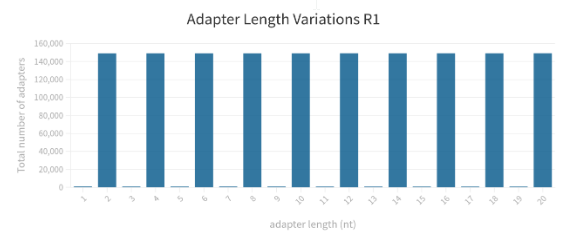

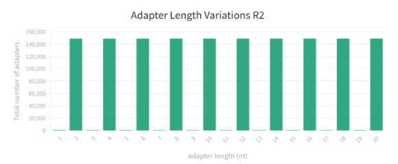

### Substitution and Indel Rate

An estimate of the error profiles for the inserts from the read files was made by using TRUE and INSERT_SIZE attributes from the error profile of each individual read.

|    | Reads Without Error | Substituion | Insertion | Deletion |
|----|---------------------|-------------|-----------|----------|
| R1 | 75.5%               | 12.0%       | 0.1%      | 12.4%    |
| R2 | 75.6%               | 12.0%       | 0.1%      | 12.3%    |

## Trimming Tools

 Four popular trimming tools were evaluated for their accuracy by disabling all trimming methods except adapter trimming and omitting minimum length cutoff.

|     Tool    | Version |                                                                                                                                Command                                                                                                                               |
|:-----------:|:-------:|:--------------------------------------------------------------------------------------------------------------------------------------------------------------------------------------------------------------------------------------------------------------------:|
| Trimmomatic |   0.39  | java -jar trimmomatic-0.39.jar PE –phred33 simulated_read.R1.fastq simulated_read.R2.fastq out_simulated_read.R1.fastq R1_unpaired.fq out_simulated_read.R2.fastq R2_unpaired.fq ILLUMINACLIP:TruSeq3-PE-2.fa:2:30:10:2:True                                         |
|  TrimGalore |  0.6.6  | trim_galore --phred33 -q=0 --length=0 -a " AGATCGGAAGAGCACACGTCTGAACTCCAGTCA -a AGATCGGAAGAGCGTCGTGTAGGGAAAGAGTGT -n 2" simulated_read.R1.fastq simulated_read.R2.fastq -o output_directory                                                                          |
|    Fastp    |  0.20.1 | fastp -Q -L --adapter_sequence=AGATCGGAAGAGCACACGTCTGAACTCCAGTCA --adapter_sequence_r2=AGATCGGAAGAGCGTCGTGTAGGGAAAGAGTGT --dont_eval_duplication -i simulated_read.R1.fastq -I simulated_read.R2.fastq -o out_simulated_read.R1.fastq -O out_simulated_read.R2.fastq |
|    Atria    |  3.1.2  | atria -r simulated_read.R1.fastq -R simulated_read.R2.fastq --no-tail-n-trim --max-n=-1 --no-quality-trim --no-length-filtration -a "AGATCGGAAGAGCACACGTCTGAACTCCAGTCA" -A "AGATCGGAAGAGCGTCGTGTAGGGAAAGAGTGT" -o output_directory                                   |
## Performance Evaluation

Accurate trimming tools are crucial for precise data analysis, ensuring adapter removal without compromising the actual insert. The evaluation criteria included accuracy percentages for trim, overtrim, and undertrim, along with nucleotide counts for overtrimming and undertrimming. The accompanying figures illustrate different types of trimming in the cleavage complex.

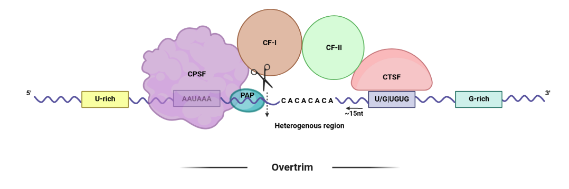 

## Results

The results for each trimmer are summarized in the following stacked bar graph:

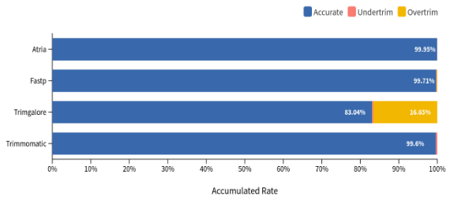

The graph indicates high accuracy for all tools except TrimGalore. Atria stands out as the most accurate tool, while TrimGalore produces numerous overtrimmed reads, potentially affecting analysis accuracy. The code also calculated the extent of undertrimming and overtrimming in terms of nucleotide counts for each tool. 

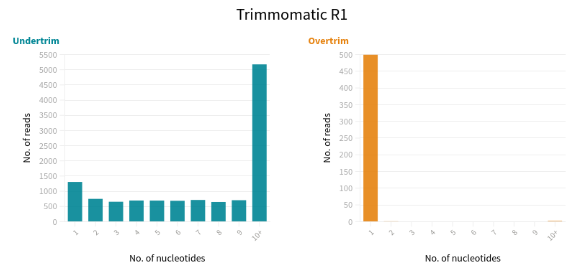

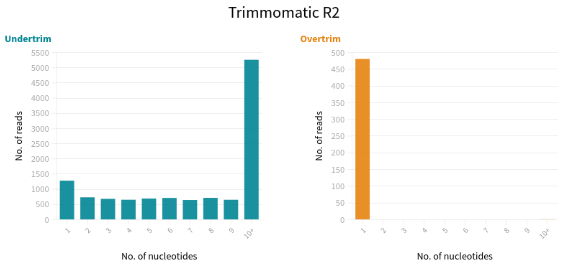

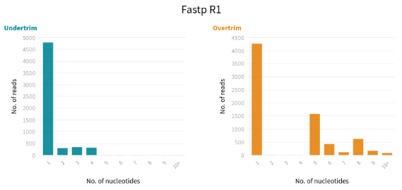

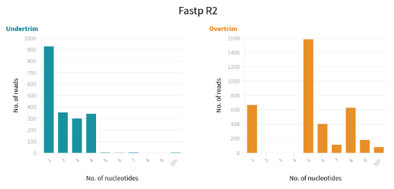

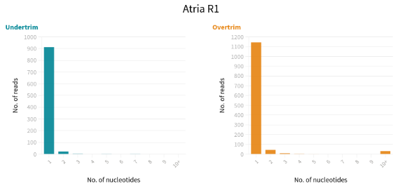

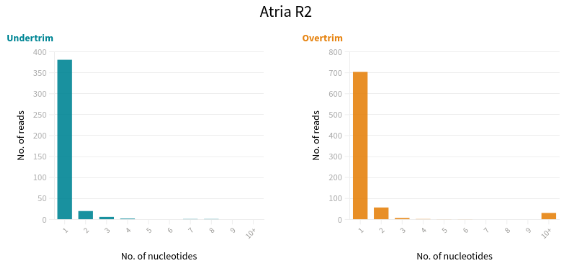

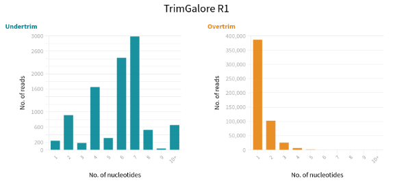

Each trimming tool has its own pattern of trimming errors. Trimmomatic tends to undertrim reads severely, while Fastp shows a balanced distribution of undertrimming and overtrimming. Atria exhibits the fewest undertrimmed and overtrimmed reads, with minimal differences of only 1 nucleotide. TrimGalore has a high number of overtrimmed reads and significant undertrimming by 7 nucleotides. Overall, Atria is the most accurate tool, followed by Fastp and Trimmomatic for adapter trimming.

## Conclusion

Quality trimming is a crucial step in next-generation sequencing data analysis as it removes adapter sequences and ensures data accuracy. The choice of trimming tool impacts the quality of the resulting data. Inaccurate trimming can lead to false positives and changes in critical base sequences. Overtrimming removes excessive sequence, potentially resulting in the loss of important information, while undertrimming fails to remove adapter sequences, compromising downstream analysis.

To select the most precise trimming tool, we evaluated popular tools: Trimmomatic, Fastp, Atria, and TrimGalore. Using simulated read data, we compared their accuracy. Trimmomatic achieved 99.6% accuracy, Fastp achieved 99.71%, Atria had the highest accuracy at 99.95%, while TrimGalore had an accuracy of 83.04%. We also analyzed the rates of overtrimming and undertrimming, finding unique patterns for each tool. TrimGalore and Trimmomatic exhibited more undertrimming, while TrimGalore and Fastp showed higher rates of overtrimming. Atria demonstrated a balanced profile with minimal overtrimming and undertrimming.

Based on our evaluation, Atria performed the best among the tested trimming tools. Its high accuracy and balanced trimming profile make it a suitable choice for quality trimming.