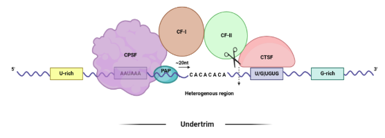

# TrimmingToolComparison

 This repository compares the performance of multiple trimming tools commonly used in DNA and RNA sequencing data analysis. 

 *Inspiration from https://github.com/cihga39871/Atria/blob/master/docs/3.Benchmark_toolkit.md*

## Table of Contents

- [Dataset Overview](## Dataset Overview)
- [Quality Evaluation of Simulated Dataset](## Quality Evaluation of Simulated Dataset)
- [Trimming Tools](## Trimming Tools)
- [Performance Evaluation](## Performance Evaluation)
- [Results](## Results)
- [Conclusion](## Conclusion)

## Dataset Overview

For comparison, Atria’s benchmarking toolkit was used for generation of simulated paired end reads. According to Atria, the read simulation process is designed to mimic sequencing-by-synthesis technology. The original DNA fragment, referred to as the insert, is synthesized by randomly selecting adenine, thymine, cytosine, and guanine in a repetitive manner. An error profile, which outlines substitution, insertion, and deletion rates, is then used to replicate the insert and adapter sequences base by base (Chuan et al., 2021). The first line of every read in the FASTQ file records the read simulation attributes. Here is an example: 

***@PeReadSimulator2:1:1 TRUE=80 INSERT_SIZE=80 ERROR_RATE=0.00102 SEQ_LENGTH=100 ERROR_INSERT=0 ERROR_ADAPTER=0 SUB=0.001 INS=1.0e-5 DEL=1.0e-5***

Three-million, one hundred and fifty thousand (3,150,000) read pairs were simulated with a uniform read length of 100bp, along with variations in adapter length, insert sizes and error profiles. All the parameters except adapter sequence 1 and 2, and sequence length were kept the default provided by atria simulate. The adapters ligated to the simulated reads were the most widely Illumina TruSeq adapters i.e., ***AGATCGGAAGAGCACACGTCTGAACTCCAGTCA*** and ***AGATCGGAAGAGCGTCGTGTAGGGAAAGAGTGT***, for read 1 and 2, respectively.  

## Quality Evaluation of Simulated Dataset

Upon generating simulated data with Atria, the simulated reads were analyzed in terms of their adapter prevalence and length, as well as any substitution and indel rates present within the reads. 

### Adapter Length Variation

The adapter length variations for both pairs of files were determined by subtracting the value of SEQ_LENGTH from the value of TRUE for each individual read in both files. The following figures depict the adapter length variations and their frequency in read 1 (R1) and read 2 (R2) individually. 

### Substitution and Indel Rate

An estimate of the error profiles for the inserts from the read files was made by using TRUE and INSERT_SIZE attributes from the error profile of each individual read.

|           | Reads without error |               Reads with error             |
|           |                     |:------------------------------------------:|
|           |                     |   Substitution  | Insertion    |  Deletion |
|:---------:|:-------------------:|:---------------:|:------------:|:---------:|
| R1        | 75.5%              -| 12.0%           | 0.1%         | 12.4%     |
|           |                     | Total: 24.5%                               |
| R2        | 75.6%               | 12.0%           | 0.1%         | 12.3%     |
|           |                     | Total: 24.4%                               |

## Trimming Tools

The evaluation process involved assessing four cutting-edge and popular trimming tools based on their trimming accuracy. For comparison purposes, all trimming methods, except adapter trimming, were disabled in the executing command, and no minimum length cutoff was allowed.

| Tool         | Version | Command                                                                                   |
|--------------|---------|-------------------------------------------------------------------------------------------|
| Trimmomatic  | 0.39    | java -jar trimmomatic-0.39.jar PE –phred33 simulated_read.R1.fastq simulated_read.R2.fastq\
              |         | out_simulated_read.R1.fastq R1_unpaired.fq out_simulated_read.R2.fastq R2_unpaired.fq     
              |         | ILLUMINACLIP:TruSeq3-PE-2.fa:2:30:10:2:True                                             |
| TrimGalore   | 0.6.6   | trim_galore --phred33 -q=0 --length=0 -a " AGATCGGAAGAGCACACGTCTGAACTCCAGTCA -a              \ 
              |         | AGATCGGAAGAGCGTCGTGTAGGGAAAGAGTGT -n 2" simulated_read.R1.fastq simulated_read.R2.fastq   \ 
              |         | -o output_directory                                                                    |
| Fastp        | 0.20.1  | fastp -Q -L --adapter_sequence=AGATCGGAAGAGCACACGTCTGAACTCCAGTCA                          \ 
              |         | --adapter_sequence_r2=AGATCGGAAGAGCGTCGTGTAGGGAAAGAGTGT --dont_eval_duplication         \ 
              |         | -i simulated_read.R1.fastq -I simulated_read.R2.fastq -o out_simulated_read.R1.fastq    \ 
              |         | -O out_simulated_read.R2.fastq                                                         |
| Atria        | 3.1.2   | atria -r simulated_read.R1.fastq -R simulated_read.R2.fastq --no-tail-n-trim --max-n=-1    \ 
              |         | --no-quality-trim --no-length-filtration -a "AGATCGGAAGAGCACACGTCTGAACTCCAGTCA"        \ 
              |         | -A "AGATCGGAAGAGCGTCGTGTAGGGAAAGAGTGT" -o output_directory                            |

## Performance Evaluation

Accuracy in analyzing sequencing data is of paramount importance, as underperforming tools can drastically alter our interpretation of the data. In the context of trimming tools, this means that the software should accurately trim adapter sequences without loss of the actual insert and remove any adapter contamination. The criteria for evaluating each trimming tool included calculating the percentage of accurate trim, overtrim, and undertrim, as well as the number of nucleotides overtrimmed or undertrimmed. The following figures, which depict the cleavage complex, illustrate each type of trim.

 

## Results

The results for each trimmer are summarized in the following stacked bar graph:

The graph shows that all of the tools, except TrimGalore, have high accuracy, with little undertrimming or overtrimming. Atria is the most accurate of the tools. TrimGalore, however, produces a large number of overtrimmed reads, which may negatively impact the accuracy of the analysis. Additionally, the amount of undertrimming and overtrimming, in terms of the number of nucleotides, was calculated utilizing the results of the same code, for each tool. 

The analysis of undertrimming and overtrimming shows that each tool has its own pattern of trimming errors. Trimmomatic tends to severely undertrim reads, with most of the undertrimmed reads having 10 or more nucleotides left untrimmed. On the other hand, most of the overtrimmed reads have been overtrimmed by only 1 nucleotide. Fastp has roughly equal amounts of undertrimming and overtrimming for each file. Atria, which is the most accurate tool, has the lowest number of undertrimmed and overtrimmed reads, with many of them having a difference of only 1 nucleotide. TrimGalore has a large number of overtrimmed reads, accounting for 16.65% of the total, with most of them being overtrimmed by 1 nucleotide. The majority of TrimGalore's undertrimmed reads have been undertrimmed by 7 nucleotides. Overall, Atria is the most accurate tool for adapter trimming, followed by Fastp and Trimmomatic. 

## Conclusion

Quality trimming, a process that involves the excision of adapter sequences added during library preparation for next-generation sequencing from the ends of raw reads, is a crucial step in ensuring the accuracy and integrity of data. However, the efficacy of the trimming tool employed can significantly affect the quality of the resulting data. If an imprecise trimming tool is employed, it may result in an excess of false positives or a difference in the base sequences, which are critical in processes such as the polyadenylation process. To avoid such detrimental effects, it is imperative that one select a trimming tool that is accurate. 

Inaccuracy in quality trimming can manifest in two major ways: overtrimming and undertrimming. Overtrimming, the removal of excess sequence, can potentially result in the loss of important information, such as affecting the single nucleotide profile at the poly(A) cleavage site by shifting the poly(A) site. Undertrimming, on the other hand, is characterized by a failure to adequately remove adapter sequences, which can also compromise downstream analyses. Given the significant impact that the selection of a trimming tool can have on the outcomes for our particular dataset, we conducted a comparison of the most popular, cutting-edge trimming tools to determine which was the most precise. The trimming tools that we evaluated were Trimmomatic, Fastp, Atria, and Trimgalore. To evaluate the trimming tools, we used Atria's simulation module to generate simulated read data. We discovered that Trimmomatic had an overall accuracy of 99.6%, Fastp had an overall accuracy of 99.71%, Atria had the highest overall accuracy of 99.95%, while TrimGalore was significantly less accurate with an overall accuracy of 83.04%. In addition to evaluating the accuracy of each tool, we also calculated the rates of overtrimming and undertrimming in terms of the number of nucleotides trimmed and found that each tool exhibited unique patterns of overtrimming and undertrimming. TrimGalore and Trimmomatic suffer the most in the case of undertrimming, whereas TrimGalore and Fastp suffer the most in case of overtrimming. In contrast, Atria had a balanced profile in both undertrimming and overtrimming, with the majority of bases being trimmed by only 1 nucleotide in either case. Upon examining the results, we found that out of all the trimming tools, Atria seemed to perform the best.